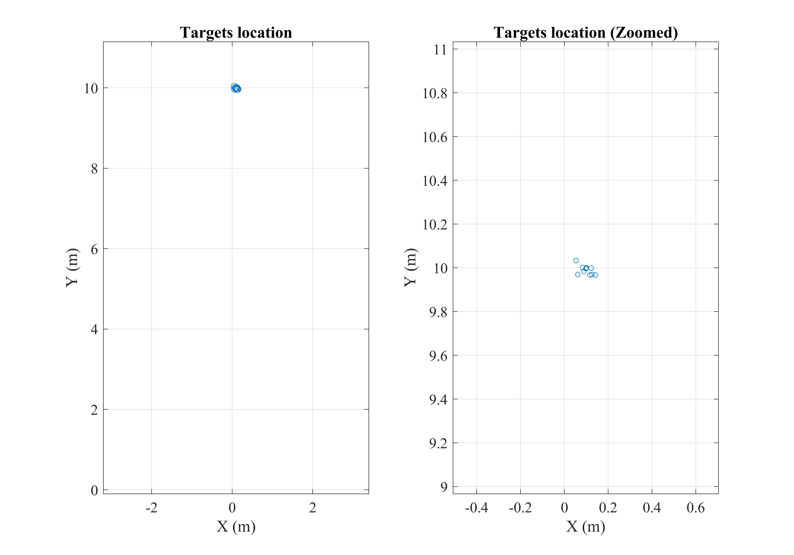
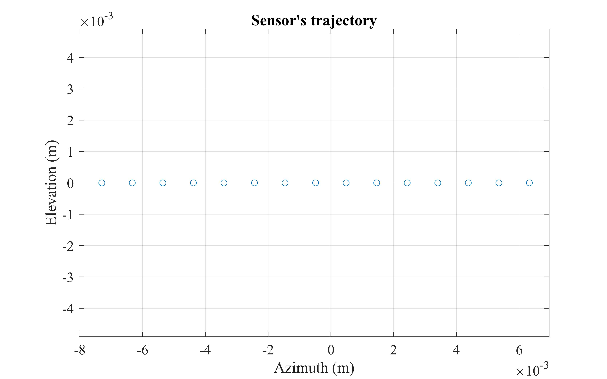
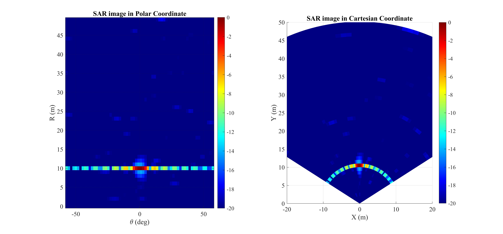
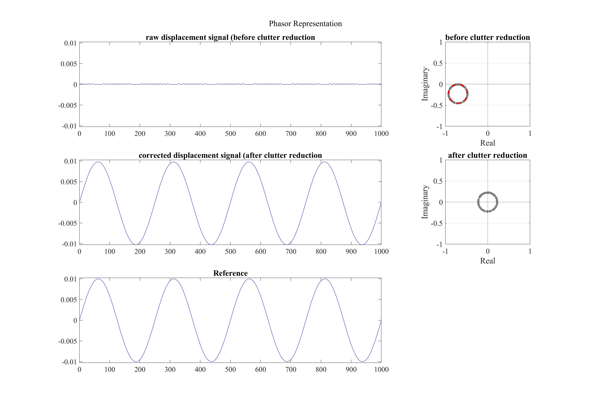

# ClutterFree-GBInSAR
Structural displacement monitoring using ground-based synthetic aperture radar (Implementation of continuous displacement monitoring and clutter reduction)

This repository demonstrates how to minimize the impact of static clutter in time-series observations of Radar/SAR signals. To achieve this, we identify the bias in the phasor representation of complex-valued time-series signals. This approach is simple yet highly effective, particularly for Radar and low-resolution SAR observations.

## Usage

For clutter analysis: first, run "ClutterR_Part1_rawdata.m" to generate the simulated data. Then, run "ClutterR_Part2_processing.m" to process the data and reduce the effect of clutters!
For continuous monitoring: first, run "Continuous_dsplcmnt_Part1_rawdata.m" to generate the simulated data. Then, run "Continuous_dsplcmnt_Part2_processing.m"!

## Results

Here is the results you can obtain by running the codes.
<p align="center">
 
</p>

<p align="center">
 
</p>

<p align="center">
 
</p>

See how this approach can highlight the displacement in the presence of heavy clutter! 

<p align="center">
 
</p>

We have further developed this method to extract fast displacements of targets from a single pass of SAR signal. We refer to this approach as continuous monitoring, where we analyze the observed SAR phase history at each range-bin to derive the displacement. This is done by eliminating the effects of range-skew, static clutters, and applying frequency-domain smoothing filtering.
The impact of each step on the phasor representation of signals is shown below:

<p align="center">
 
</p>

And finally, this the displacement that you can expect to obtain after processing these steps:

<p align="center">
 
</p>

Note that since this approach only utilizes phase information, it is more sensitive to noise and the stability of scatterers. This motivated us to further improve our algorithm by developing it based on Spectral Estimation and Beamforming techniques. 
For more details, please check out my other repository: [Spectral-GBSAR](https://github.com/Benyaminhosseiny/Spectral-GBSAR)

## Paper
You can find more results and discussions in our paper: 

[Elsevier](https://www.sciencedirect.com/science/article/pii/S1569843222003326) 

[ResearchGate](https://www.researchgate.net/publication/366313295_Structural_displacement_monitoring_using_ground-based_synthetic_aperture_radar)

## Citation
If you find this work useful, please cite us in your work:
```
@article{3D-GBSAR,
	title = {Structural displacement monitoring using ground-based synthetic aperture radar},
	volume = {116},
	issn = {1872826X},
	doi = {10.1016/j.jag.2022.103144},
	pages = {103144},
	journaltitle = {International Journal of Applied Earth Observation and Geoinformation},
	author = {Hosseiny, Benyamin and Amini, Jalal and Aghababaei, Hossein},
	date = {2023-02},
	note = {Publisher: Elsevier},
	keywords = {{MIMO} radar, Vibration, {mmWave} radar, {SAR} interferometry, Structural health monitoring},
}
```
