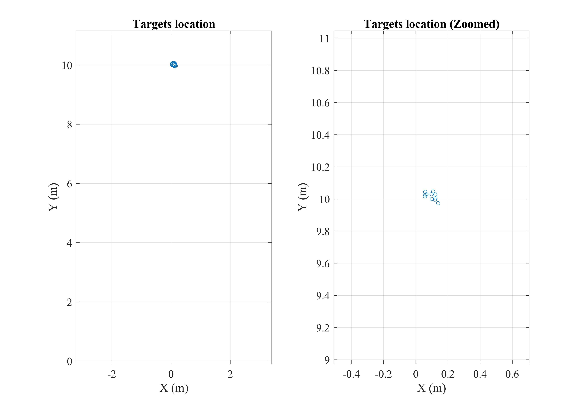
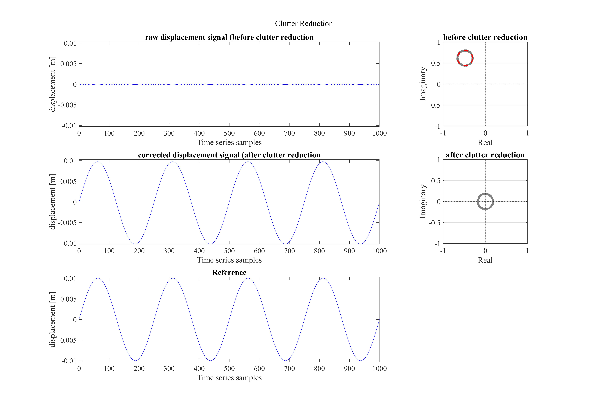

# ClutterFree-GBInSAR

This repository demonstrates how to minimize the impact of static clutter in time-series observations of Radar/SAR signals. To achieve this, we identify the bias in the phasor representation of complex-valued time-series signals. This approach is simple yet highly effective, particularly for Radar and low-resolution SAR observations.
## Usage
First, run "ClutterR_Part1_rawdata.m" to generate the simulated data.
Then, run "ClutterR_Part2_processing.m" to process the data and reduce the effect of clutters!

## Results

Here is the results you can obtain by running the codes.
<p align="center">
 
</p>

<p align="center">
 
</p>

<p align="center">
 
</p>

See how this approach can highlight the displacement in the presence of heavy clutter! 

<p align="center">
 
</p>

## Paper
Link to the paper: 

[Elsevier](https://www.sciencedirect.com/science/article/pii/S1569843222003326) 

[ResearchGate](https://www.researchgate.net/publication/366313295_Structural_displacement_monitoring_using_ground-based_synthetic_aperture_radar)

## Citation
If you find this work useful, please cite us in your work:
```
@article{3D-GBSAR,
	title = {Structural displacement monitoring using ground-based synthetic aperture radar},
	volume = {116},
	issn = {1872826X},
	doi = {10.1016/j.jag.2022.103144},
	pages = {103144},
	journaltitle = {International Journal of Applied Earth Observation and Geoinformation},
	author = {Hosseiny, Benyamin and Amini, Jalal and Aghababaei, Hossein},
	date = {2023-02},
	note = {Publisher: Elsevier},
	keywords = {{MIMO} radar, Vibration, {mmWave} radar, {SAR} interferometry, Structural health monitoring},
}
```
